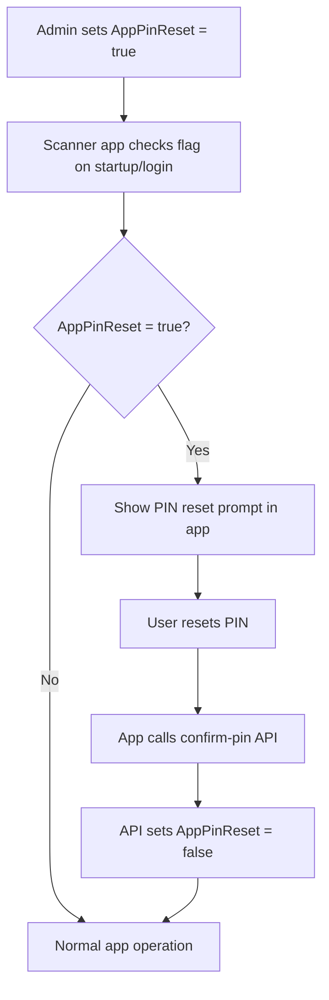

# AppPinReset Feature Documentation

## Overview
The `AppPinReset` feature allows administrators to flag scanners that need to reset their PIN in the mobile app. This is useful for security purposes or when a scanner's PIN needs to be changed.

## Database Schema

### Scanner Table Addition
```sql
ALTER TABLE [Scanners] ADD [AppPinReset] bit NOT NULL DEFAULT CAST(0 AS bit);
```

## API Endpoints

### 1. Set AppPinReset Flag
**Endpoint:** `POST /api/scanners/set-app-pin-reset`  
**Authorization:** Admin, Staff roles only  
**Purpose:** Set or clear the AppPinReset flag for a specific scanner

**Request Body:**
```json
{
  "serialNo": "SCN001",
  "appPinReset": true
}
```

**Response:**
```json
{
  "message": "AppPinReset flag set successfully for scanner SCN001"
}
```

### 2. Confirm PIN (Enhanced)
**Endpoint:** `POST /api/scanners/confirm-pin`  
**Authorization:** Anonymous (for scanner login)  
**Purpose:** Scanner login that now includes AppPinReset status and automatically resets the flag

**Request Body:**
```json
{
  "serialNo": "SCN001",
  "scannerPIN": "123456"
}
```

**Response:**
```json
{
  "isValid": true,
  "message": "PIN confirmed successfully",
  "appPinReset": false,  // This will be false after successful PIN confirmation
  "token": "eyJhbGciOiJIUzI1NiIsInR5cCI6IkpXVCJ9...",
  "refreshToken": "base64-encoded-refresh-token",
  "tokenExpiry": "2024-01-08T12:00:00Z",
  "refreshTokenExpiry": "2024-02-07T12:00:00Z"
}
```

### 3. Get Scanner Info (Enhanced)
**Endpoint:** `GET /api/scanners/my-info`  
**Authorization:** Scanner role  
**Purpose:** Get scanner details including AppPinReset status

**Response:**
```json
{
  "id": 1,
  "serialNo": "SCN001",
  "scannerName": "Main Scanner",
  "locationName": "Warehouse A",
  "isActive": true,
  "appPinReset": false
}
```

## Business Logic

### AppPinReset Flag Behavior

1. **Default State:** `AppPinReset = false` for all new scanners
2. **Admin Action:** Admin/Staff can set `AppPinReset = true` via API
3. **Auto Reset:** When scanner successfully confirms PIN, `AppPinReset` is automatically set to `false`
4. **Mobile App Check:** Mobile app should check this flag and prompt for PIN reset if `true`

### Workflow



## Mobile App Implementation

### React Native Example

```javascript
// Check AppPinReset status after login
const handleScannerLogin = async (serialNo, pin) => {
  try {
    const response = await ScannerApiService.confirmPin(serialNo, pin);
    
    // Check if PIN reset was required (this would have been true before login)
    if (response.appPinReset) {
      Alert.alert(
        'PIN Reset Completed',
        'Your PIN reset has been processed successfully.',
        [{ text: 'OK' }]
      );
    }
    
    // Continue with normal login flow
    navigation.replace('ScannerHome');
  } catch (error) {
    Alert.alert('Login Failed', error.message);
  }
};

// Check AppPinReset status periodically or on app startup
const checkPinResetStatus = async () => {
  try {
    const scannerInfo = await ScannerApiService.getScannerInfo();
    
    if (scannerInfo.appPinReset) {
      Alert.alert(
        'PIN Reset Required',
        'Your administrator has requested that you reset your PIN. Please contact your supervisor.',
        [
          {
            text: 'OK',
            onPress: () => {
              // You might want to navigate to a PIN reset screen
              // or show instructions to contact admin
            }
          }
        ]
      );
    }
  } catch (error) {
    console.error('Error checking PIN reset status:', error);
  }
};
```

### Flutter Example

```dart
// Check AppPinReset status
Future<void> checkPinResetStatus() async {
  try {
    final scannerInfo = await ScannerApiService.getScannerInfo();
    
    if (scannerInfo['appPinReset'] == true) {
      showDialog(
        context: context,
        builder: (context) => AlertDialog(
          title: Text('PIN Reset Required'),
          content: Text('Your administrator has requested that you reset your PIN. Please contact your supervisor.'),
          actions: [
            TextButton(
              onPressed: () => Navigator.of(context).pop(),
              child: Text('OK'),
            ),
          ],
        ),
      );
    }
  } catch (error) {
    print('Error checking PIN reset status: $error');
  }
}
```

## Admin Dashboard Usage

### Setting AppPinReset Flag

```javascript
// Admin function to flag scanner for PIN reset
const flagScannerForPinReset = async (serialNo) => {
  try {
    const response = await fetch('/api/scanners/set-app-pin-reset', {
      method: 'POST',
      headers: {
        'Authorization': `Bearer ${adminToken}`,
        'Content-Type': 'application/json'
      },
      body: JSON.stringify({
        serialNo: serialNo,
        appPinReset: true
      })
    });

    if (response.ok) {
      alert('Scanner flagged for PIN reset successfully');
    }
  } catch (error) {
    alert('Failed to flag scanner for PIN reset');
  }
};

// Admin function to clear AppPinReset flag
const clearScannerPinResetFlag = async (serialNo) => {
  try {
    const response = await fetch('/api/scanners/set-app-pin-reset', {
      method: 'POST',
      headers: {
        'Authorization': `Bearer ${adminToken}`,
        'Content-Type': 'application/json'
      },
      body: JSON.stringify({
        serialNo: serialNo,
        appPinReset: false
      })
    });

    if (response.ok) {
      alert('PIN reset flag cleared successfully');
    }
  } catch (error) {
    alert('Failed to clear PIN reset flag');
  }
};
```

## Use Cases

1. **Security Incident:** If a scanner's PIN is compromised, admin can flag it for reset
2. **Regular Maintenance:** Periodic PIN resets for security compliance
3. **Device Transfer:** When a scanner is moved to a new location or user
4. **Policy Enforcement:** Enforce PIN changes after certain time periods

## Security Considerations

1. **Admin Only:** Only Admin and Staff roles can set the AppPinReset flag
2. **Auto Clear:** Flag is automatically cleared when PIN is successfully confirmed
3. **Audit Trail:** All PIN reset actions should be logged for security auditing
4. **User Notification:** Mobile app should clearly communicate why PIN reset is required

## Database Migration

The migration `20260107183502_AddAppPinResetToScanner` adds:
- `AppPinReset` column as `bit NOT NULL` with default value `false`
- Existing scanners will have `AppPinReset = false` by default

This feature provides administrators with a secure way to manage scanner PIN resets while maintaining a smooth user experience in the mobile app.