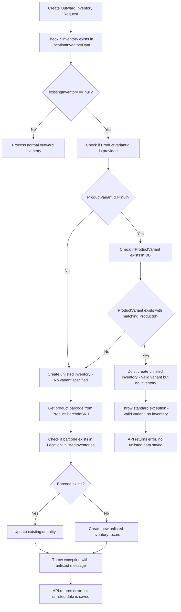

# Location Unlisted Inventory Feature

## Overview
The `LocationUnlistedInventory` feature automatically captures barcode details when products are scanned but don't exist in the regular `LocationInventoryData`. This helps track unknown or unlisted products that are being processed at locations.

## Database Schema

### LocationUnlistedInventories Table
```sql
CREATE TABLE [LocationUnlistedInventories] (
    [Id] int NOT NULL IDENTITY,
    [BarcodeNo] nvarchar(100) NOT NULL,
    [LocationId] int NOT NULL,
    [Quantity] int NOT NULL,
    [CreatedBy] int NOT NULL,
    [CreatedDate] datetime2 NOT NULL DEFAULT (GETUTCDATE()),
    [UpdatedBy] int NULL,
    [UpdatedDate] datetime2 NULL,
    CONSTRAINT [PK_LocationUnlistedInventories] PRIMARY KEY ([Id]),
    CONSTRAINT [FK_LocationUnlistedInventories_Locations_LocationId] FOREIGN KEY ([LocationId]) REFERENCES [Locations] ([Id]),
    CONSTRAINT [FK_LocationUnlistedInventories_Users_CreatedBy] FOREIGN KEY ([CreatedBy]) REFERENCES [Users] ([Id]),
    CONSTRAINT [FK_LocationUnlistedInventories_Users_UpdatedBy] FOREIGN KEY ([UpdatedBy]) REFERENCES [Users] ([Id])
);
```

## Business Logic

### Trigger Condition
The feature is triggered in the `LocationOutwardInventoryService.CreateOutwardInventoryAsync` method at line 137 when:
- `existingInventory` is `null` (product doesn't exist in LocationInventoryData)
- **AND** either:
  - `ProductVariantId` is `null`, OR
  - `ProductVariantId` and `ProductId` combination doesn't exist in the `ProductVariants` table

### Enhanced Workflow


### Enhanced Data Capture Logic
```csharp
if (existingInventory == null)
{
    // Additional check: Verify if ProductId and ProductVariantId combination exists in ProductVariants table
    bool productVariantExists = true;
    if (createDto.ProductVariantId.HasValue)
    {
        var productVariant = await _productVariantRepository.GetByIdAsync(createDto.ProductVariantId.Value);
        productVariantExists = productVariant != null && productVariant.ProductId == createDto.ProductId;
    }

    // Only create unlisted inventory if both conditions are met:
    // 1. No inventory exists in LocationInventoryData
    // 2. ProductId and ProductVariantId combination doesn't exist in ProductVariants table (if ProductVariantId is provided)
    if (!productVariantExists || createDto.ProductVariantId == null)
    {
        // Get the barcode from the product
        var barcodeNo = product.BarcodeSKU ?? $"UNKNOWN_{createDto.ProductId}";
        
        // Check if this barcode already exists in unlisted inventory for this location
        var existingUnlistedInventory = await _locationUnlistedInventoryRepository
            .GetByBarcodeAndLocationAsync(barcodeNo, createDto.LocationId);
        
        if (existingUnlistedInventory != null)
        {
            // Update existing unlisted inventory quantity
            existingUnlistedInventory.Quantity += createDto.Quantity;
            existingUnlistedInventory.UpdatedBy = createDto.CreatedBy;
            existingUnlistedInventory.UpdatedDate = DateTime.UtcNow;
            await _locationUnlistedInventoryRepository.UpdateAsync(existingUnlistedInventory);
        }
        else
        {
            // Create new unlisted inventory entry
            var unlistedInventory = new LocationUnlistedInventory
            {
                BarcodeNo = barcodeNo,
                LocationId = createDto.LocationId,
                Quantity = createDto.Quantity,
                CreatedBy = createDto.CreatedBy,
                CreatedDate = DateTime.UtcNow
            };
            
            await _locationUnlistedInventoryRepository.AddAsync(unlistedInventory);
        }
        
        // Still throw exception to maintain existing API behavior, but unlisted inventory is now recorded
        throw new ArgumentException("No inventory found for this location, product, and variant combination. Item has been recorded as unlisted inventory.");
    }
    else
    {
        // ProductVariant exists but no inventory - this is a different scenario
        throw new ArgumentException("No inventory found for this location, product, and variant combination");
    }
}
```

## API Behavior

### Enhanced Logic Scenarios

The system now handles different scenarios based on the existence of inventory and product variants:

#### Scenario 1: Normal Operation
- ✅ `existingInventory` exists in `LocationInventoryData`
- **Result**: Normal outward inventory processing

#### Scenario 2: Valid Product Variant, No Inventory
- ❌ `existingInventory` is `null`
- ✅ `ProductVariantId` exists and matches `ProductId` in `ProductVariants` table
- **Result**: Standard error message, **NO** unlisted inventory created
- **Message**: `"No inventory found for this location, product, and variant combination"`

#### Scenario 3: Invalid/Missing Product Variant
- ❌ `existingInventory` is `null`
- ❌ `ProductVariantId` is `null` OR doesn't exist in `ProductVariants` table OR doesn't match `ProductId`
- **Result**: Create/update unlisted inventory, then throw error
- **Message**: `"No inventory found for this location, product, and variant combination. Item has been recorded as unlisted inventory."`

### Current API Response
When a product doesn't exist in LocationInventoryData:

**Before Enhancement:**
```json
{
  "error": "No inventory found for this location, product, and variant combination"
}
```

**After Enhancement:**
```json
{
  "error": "No inventory found for this location, product, and variant combination. Item has been recorded as unlisted inventory."
}
```

### Key Points
1. **API Still Returns Error**: The API maintains existing behavior by returning an error
2. **Data is Captured**: Despite the error, the barcode and quantity are saved to LocationUnlistedInventories
3. **Quantity Accumulation**: If the same barcode is scanned multiple times, quantities are accumulated
4. **Audit Trail**: Full audit trail with CreatedBy, CreatedDate, UpdatedBy, UpdatedDate

## Data Model

### LocationUnlistedInventory Entity
```csharp
public class LocationUnlistedInventory
{
    public int Id { get; set; }
    public string BarcodeNo { get; set; } = string.Empty;
    public int LocationId { get; set; }
    public int Quantity { get; set; }
    public int CreatedBy { get; set; }
    public DateTime CreatedDate { get; set; } = DateTime.UtcNow;
    public int? UpdatedBy { get; set; }
    public DateTime? UpdatedDate { get; set; }
    
    // Navigation properties
    public virtual Location Location { get; set; } = null!;
    public virtual User CreatedByUser { get; set; } = null!;
    public virtual User? UpdatedByUser { get; set; }
}
```

### DTOs
```csharp
public class LocationUnlistedInventoryDto
{
    public int Id { get; set; }
    public string BarcodeNo { get; set; } = string.Empty;
    public int LocationId { get; set; }
    public string LocationName { get; set; } = string.Empty;
    public int Quantity { get; set; }
    public int CreatedBy { get; set; }
    public string CreatedByName { get; set; } = string.Empty;
    public DateTime CreatedDate { get; set; }
    public int? UpdatedBy { get; set; }
    public string? UpdatedByName { get; set; }
    public DateTime? UpdatedDate { get; set; }
}
```

## Repository Methods

### ILocationUnlistedInventoryRepository
```csharp
public interface ILocationUnlistedInventoryRepository : IGenericRepository<LocationUnlistedInventory>
{
    Task<IEnumerable<LocationUnlistedInventory>> GetByLocationIdAsync(int locationId);
    Task<LocationUnlistedInventory?> GetByBarcodeAndLocationAsync(string barcodeNo, int locationId);
}
```

## Use Cases

### 1. Unknown Product Scanning
- Scanner scans a barcode for a product that doesn't exist in the system
- **Condition**: `ProductVariantId` is null or invalid
- **Action**: Product is recorded in unlisted inventory for later review

### 2. Invalid Product Variant Combinations
- Scanner scans a product with a variant that doesn't exist in the `ProductVariants` table
- **Condition**: `ProductVariantId` doesn't match any record with the given `ProductId`
- **Action**: Recorded as unlisted inventory since the variant combination is invalid

### 3. Valid Product Variant, Missing Inventory
- Scanner scans a valid product variant that exists in the system but has no inventory at the location
- **Condition**: `ProductVariant` exists and matches `ProductId`, but no `LocationInventoryData`
- **Action**: Standard error, **NO** unlisted inventory created (this is a legitimate inventory shortage)

### 4. Inventory Discrepancy Tracking
- Products that should exist but aren't in LocationInventoryData
- Helps identify data sync issues between systems
- Provides audit trail for inventory discrepancies

### 5. New Product Discovery
- Capture new products before they're officially added to the system
- Temporary holding area for products pending approval
- Historical record of when/where new products first appeared

## Barcode Handling

### Barcode Source Priority
1. **Primary**: `Product.BarcodeSKU` (if available)
2. **Fallback**: `UNKNOWN_{ProductId}` (if BarcodeSKU is null)

### Example Scenarios
```csharp
// Scenario 1: Product has barcode
Product.BarcodeSKU = "123456789"
→ LocationUnlistedInventory.BarcodeNo = "123456789"

// Scenario 2: Product has no barcode
Product.BarcodeSKU = null, Product.Id = 42
→ LocationUnlistedInventory.BarcodeNo = "UNKNOWN_42"
```

## Quantity Management

### Accumulation Logic
- **First Scan**: Creates new record with initial quantity
- **Subsequent Scans**: Adds to existing quantity for same barcode + location
- **Update Tracking**: Records who and when quantities were updated

### Example
```
Initial scan: BarcodeNo="ABC123", LocationId=1, Quantity=5
Second scan: BarcodeNo="ABC123", LocationId=1, Quantity=3
Result: Total Quantity=8, UpdatedBy and UpdatedDate recorded
```

## Migration Details

**Migration**: `20260110171246_AddLocationUnlistedInventoryTable`

**Changes Applied**:
- Created `LocationUnlistedInventories` table
- Added foreign key constraints to Locations and Users tables
- Added indexes for performance optimization
- Set default value for CreatedDate using `GETUTCDATE()`

## Future Enhancements

### Potential Features
1. **Admin Dashboard**: View and manage unlisted inventory items
2. **Bulk Processing**: Convert unlisted items to regular inventory
3. **Reporting**: Analytics on unlisted inventory patterns
4. **Notifications**: Alert admins when unlisted items are detected
5. **Integration**: Sync with external inventory management systems

### API Endpoints (Future)
```
GET /api/location-unlisted-inventory/{locationId} - Get unlisted items by location
POST /api/location-unlisted-inventory/convert - Convert to regular inventory
DELETE /api/location-unlisted-inventory/{id} - Remove unlisted item
```

## Benefits

1. **Data Preservation**: No data loss when products don't exist in main inventory
2. **Audit Trail**: Complete tracking of who scanned what and when
3. **Business Intelligence**: Insights into inventory gaps and new product trends
4. **Error Recovery**: Ability to recover and process previously "failed" scans
5. **Compliance**: Maintains data integrity while preserving business operations

This feature ensures that no barcode scan is lost, even when the product doesn't exist in the main inventory system, providing valuable data for inventory management and business analysis.